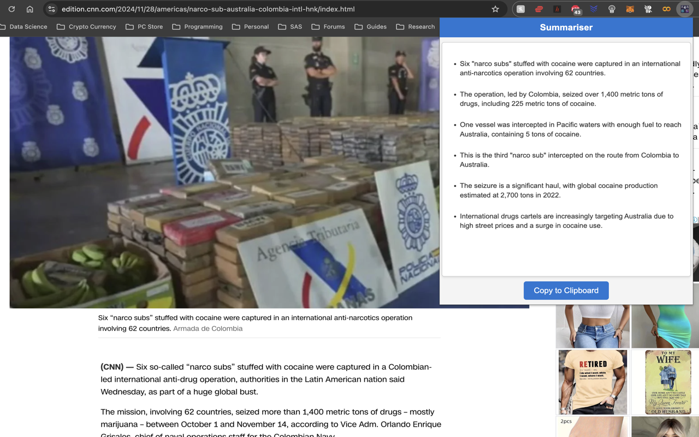
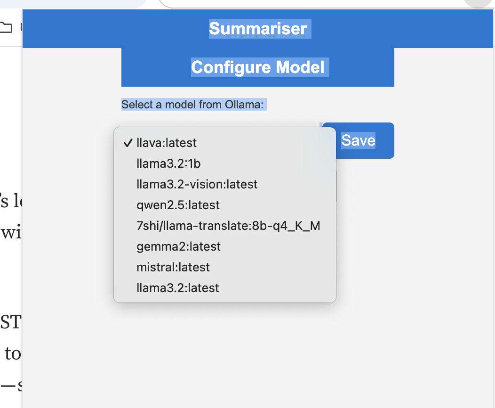

# **Web Page Summarizer Extension**

A Chrome extension that allows you to summarize the content of any active web page using the **Ollama** local LLM API. With just one click, the extension extracts visible content, generates a concise summary, and displays it in a user-friendly popup.



---

## **Features**
- Quickly generate concise summaries for any web page.
- Supports markdown-formatted summaries for better readability.
- Copy the generated summary to the clipboard for later use.
- Customizable to select your desired model using Ollama.

---

## **Requirements**
1. **Chrome Browser**: Version 100 or later.
2. **Ollama API**:
   - A locally installed and running Ollama server.
   - Supported models like `llama2` or `llama3.2`.

---

## **Setup Instructions**

### **Step 1: Clone or Download the Extension**
1. Clone this repository or download it as a ZIP file.
   ```bash
   git clone git@github.com:auslei/ollama_summarise_chrome_extension.git
   cd ollama_summarise_chrome_extension
   ```

2. Extract the ZIP file if downloaded.

---

### **Step 2: Install and Run Ollama**
1. Download and install Ollama from their official website: [Ollama Official Website](https://www.ollama.com/).
2. Start the Ollama server on your local machine:
   ```bash
   ollama serve
   ```
3. Configure the Ollama server to allow local API requests:
   ```bash
   launchctl setenv OLLAMA_ORIGINS "*"
   ```

   For windows:
   
   Under User variables, click New and add:
    - Name: OLLAMA_ORIGINS
	- Value: *

    or, in command prompt:

    ```
    setx OLLAMA_ORIGINS "*"
    ```

4. Download a model:
   ```bash
   ollama pull llama3.2
   ```
   > **Note**: This allows the extension to communicate with the Ollama API.

4. Ensure the API is running at `http://localhost:11434`.

---

### **Step 3: Load the Extension into Chrome**
1. Open Chrome and navigate to `chrome://extensions/`.
2. Enable **Developer Mode** (toggle in the top-right corner).
3. Click **"Load unpacked"**.
4. Select the directory where this extension is located.

---

### **Step 4: Configure the Extension (Optional)**
1. Open the extension popup.
2. If this is your first time using the extension, you may be prompted to select a model (e.g., `llama2`, `llama3.2`) from the dropdown.
3. Your selection will be saved and used for all subsequent summarization requests.

---

## **How to Use the Extension**
1. Navigate to any webpage you want to summarize.
2. Wait for the extension to fetch the content and generate a summary.
3. Copy the summary using the **Copy to Clipboard** button if needed.

If first time  using the extension, you will be prompted to select a model.


---

## **Key Components**
- **Popup Interface**:
  - Displays the summary in markdown format.
  - Allows copying the summary to the clipboard.
- **Ollama Integration**:
  - Sends extracted page content to the locally running Ollama API for summarization.
- **Customizable Models**:
  - Supports model selection via the configuration screen.

---

## **Screenshot**


---

## **References**
- **Ollama API Documentation**: [Ollama API Docs](https://www.ollama.com/)
- **Chrome Extension Development Guide**: [Chrome Developer Documentation](https://developer.chrome.com/docs/extensions/)

---

## **Future Enhancements**
- Support for multiple languages.
- Integration with cloud-based summarization APIs.
- Enhanced styling and customization options for the popup.

---

## **Contributing**
If you'd like to contribute to this project:
1. Fork the repository.
2. Create a new feature branch.
3. Submit a pull request with detailed explanations of your changes.

---

## **License**
This project is licensed under the MIT License. See the `LICENSE` file for details.
